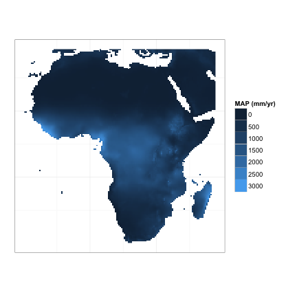

Making a Simple Map in R
========================================================

I started messing around with plotting geographical data using ``ggplot2`` yesterday and some folks are interested in the basic syntax. Admittedly, what I have here is not the best (i.e. I don't truly map latitude longitude, but instead just ``melt`` the netcdf matrix), so hopefully someone will fork this and make it better!

The Code
----------
First download the CRU precipitation data from this repository to your local working directory of choice (``wkdir``).

Start by loading the necessary libraries (``ncdf``, ``ggplot2``, and ``reshape``) and naming some data variables.


```r
# Set working directory (change according to your system) Make sure to
# download the CRU precipitation data to the wkdir
wkdir = "/users/atredenn/Plot_geographical_data/"
setwd(wkdir)

# Load the appropriate libraries
library(ncdf)
library(ggplot2)
library(reshape)

# Extract netCDF data and place precipitation data ('pre') in the variable
# 'Rain0'
Rain.NC <- open.ncdf("africa_cru_3.0.1961.2006.meanAnnPrec.nc")
Rain <- get.var.ncdf(Rain.NC, "pre")

# We can get coordinate values too. Maybe someone can then use these in
# the ggplot call!
Latit <- get.var.ncdf(Rain.NC, "lat")
Longit <- get.var.ncdf(Rain.NC, "lon")

# And set all values less than zero to 'NA'
Rain[Rain < 0] <- NA
```


Now we can move to actually making the plot. First we melt the data,


```r
# Melt the data for easier plotting
rain_df = melt(Rain)
```


Then we can make the plot. I've chosen all blank axes since I am plotting all of Africa. For something less obvious one may want to include geographic coordinates. I am working on how to do that, so stay posted. And, if someone else figures it out, let me know.


```r
# Set up an empty theme to take out gray background, etc.
theme_set(theme_bw())

# Then call ggplot with x and y values as the X1 and X2 variables created
# by melt
ggplot(aes(x = X1, y = rev(X2), fill = value), data = rain_df) + 
    geom_raster() + coord_equal() + scale_fill_continuous(na.value = "transparent") + 
    labs(fill = "MAP (mm/yr)") + opts(axis.text.x = theme_blank(), axis.text.y = theme_blank(), 
    axis.ticks = theme_blank(), axis.title.x = theme_blank(), axis.title.y = theme_blank())
```

 


